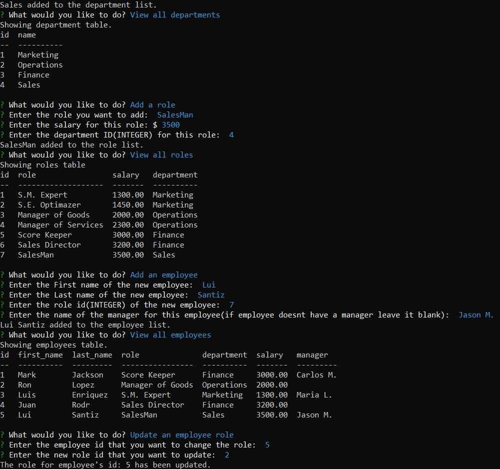

# Employee Tracker App
Video Walkthrough: [https://drive.google.com/file/d/1sC5hfJtXUUrAb0JX4GvxHk6ljzJQm1R4/view](https://drive.google.com/file/d/1sC5hfJtXUUrAb0JX4GvxHk6ljzJQm1R4/view)
## ToC
- [Description](#description)
- [Features](#features)
- [Usage](#usage)
- [Preview](#preview)

## Description
With user prompts in the command line you would be able to modify and update tables with information related with your company.
## Features 
- Node.
- Inquirer.
- dotenv.
- mysql.
- console.table.

## Usage
Open command line and enter 'npm start', navigate thru the menu and answer all the prompt questions.

## Preview

